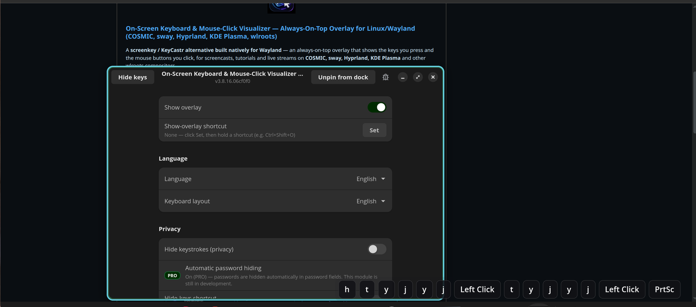

# On-Screen Keyboard & Mouse-Click Visualizer — Always-On-Top Overlay for Linux/Wayland (COSMIC, sway, Hyprland, KDE Plasma, wlroots)

[](LICENSE) [](https://vibecodeblogger-public.github.io/screenkey-wayland-alternative-with-mouse-clicks-public/) [](https://github.com/VibeCodeBlogger-Public/screenkey-wayland-alternative-with-mouse-clicks-public/releases)

Screenkey/KeyCastr alternative for Wayland: an always-on-top overlay showing keyboard keystrokes and mouse clicks for screencasts, tutorials and streams (COSMIC, sway, Hyprland, KDE Plasma, wlroots).

The **On-Screen Keyboard & Mouse-Click Visualizer — Always-On-Top Overlay for Linux/Wayland (COSMIC, sway, Hyprland, KDE Plasma, wlroots)** draws a small bar at the edge of your
screen that lights up with the keys you press and the mouse buttons you click,
so your audience can follow along in recordings and live streams. It is built
natively for Wayland with GTK4 and `gtk4-layer-shell`, stays pinned on top, and
never steals keyboard focus.



## A screenkey alternative for Wayland

Classic tools like `screenkey` and `key-mon` rely on X11 and do not work under a
Wayland session. This overlay is designed for Wayland compositors from the
ground up:

- Renders on the **overlay layer** via `gtk4-layer-shell`, so it stays above
  normal windows (true always-on-top) on **Pop!_OS COSMIC**, **sway**,
  **Hyprland**, **KDE Plasma** and other **wlroots**-based compositors.
- Never grabs the keyboard (`keyboard-mode: none`) and uses a click-through
  input region, so your global shortcuts and clicks keep working normally.
- Reads input events directly from `libinput`, so it captures keystrokes
  regardless of which application is focused.

Unlike a draggable floating window, the bar is **pinned** to a screen edge and
positioned by percentage, so it stays exactly where you put it across
resolutions and fractional scaling — convenient for an OBS scene you set up once.

## Show keyboard and mouse clicks on screen

The overlay visualizes both halves of your input in one bar:

- **Keyboard:** individual keys and key combinations, translated through
  `xkbcommon` so they match your active layout (including shifted symbols and
  modifiers like Ctrl, Alt and Super).
- **Mouse:** left, right, middle and side (back/forward) button clicks, shown as
  labels alongside the keys.

Recent events scroll across the bar and fade out on their own, keeping the
overlay unobtrusive during a recording (or you can keep it always visible).

## KeyCastr for Linux

If you have used **KeyCastr** on macOS to show your keys during a demo, this
tool gives you the same workflow on Linux/Wayland. Point your screen recorder or
OBS capture at your display and the overlay is captured along with everything
else.

## Settings

Launching `keysclicks` opens a small libadwaita settings window. The on-screen
bar is a separate layer-shell surface; the window just configures it, and
**every change applies live** and is saved immediately. The window is organised
into groups:

- **Keys and clicks display** — *Show overlay* (master on/off for the on-screen
  bar), label style (Composed / Raw / Compact), font size, *Show keyboard*, *Show
  mouse*, *Show Shift separately* and *Draw border*.
- **Position and behaviour** — screen edge (Top / Bottom); **horizontal and
  vertical margins as a percentage** of the monitor, so placement is
  resolution- and zoom-independent (the horizontal slider runs from −100 % =
  flush left, through 0 % = centre, to +100 % = flush right); the **overlay
  monitor** (an *Automatic* entry plus every connected output, read live from
  GDK — changing it prompts a quick restart, because a Wayland layer surface
  cannot move outputs while it is mapped); *Keep visible (no timeout)*, chip
  timeout in milliseconds, and bar opacity.
- **Privacy** — the *Hide keys* toggle and the *Hide-keys shortcut* (see
  [Privacy](#privacy-hide-keystrokes)).

The **Show overlay** toggle (in *Keys and clicks display*) turns the on-screen bar
off and on live, without quitting. Closing the settings window quits the app, which
also removes the overlay.

### Persistence

Settings are stored as a plain INI file at
`$XDG_CONFIG_HOME/keysclicks/settings.ini` (usually
`~/.config/keysclicks/settings.ini`) and reloaded on the next launch.

### Global shortcuts

Wayland has no client-side global hotkeys — a global shortcut is always a
compositor binding. The overlay runs whenever the app is open (quit to stop it).
For privacy, the **Hide-keys shortcut** is captured inside the app: click **Set**
in the *Privacy* group and hold a key combination. It is detected read-only from
the input stream and never injected, and it toggles keystroke masking. To
launch/quit the app from a key, bind a compositor shortcut: on COSMIC,
**Settings → Keyboard → Shortcuts**; on sway/Hyprland add a `bindsym`/`bind`.

## Privacy (hide keystrokes)

To avoid leaking a password or 2FA code on stream, the overlay can **hide
keystrokes**: each key is shown as a neutral `•` instead of its real symbol
(mouse clicks are unaffected). This works in every label mode. Turn it on with
the **Hide keys** toggle in the settings header (or the switch in the *Privacy*
group), or assign a **Hide-keys shortcut** — click **Set** and hold a
combination.

Automatic masking (hide keys **only** while a password field is focused) is
provided by an **optional, separately distributed PRO provider module** that the
app loads through a small frozen plugin ABI. The base app never requires it and
degrades gracefully when it is absent — the plugin ABI is documented in the public
header [include/keysclicks-privacy-provider.h](include/keysclicks-privacy-provider.h).

## Report a bug

The settings window has a **Report a bug** button (top-right, the bug icon). It
sends your note — and, **only if you tick the box**, a screenshot and basic
diagnostics — to the maintainer, so issues reach us with context. Nothing leaves
your machine unless you press *Send*, and there is no background telemetry.

## Languages

The interface is translated into 30+ languages. It opens in your system language
automatically, and you can switch it live from **Language** in the settings window
(each language is listed in its own script). Right-to-left layouts (Arabic, Persian,
Urdu) are mirrored. Translation catalogs live in `po/<code>.po`.

## Compatibility

Always-on-top relies on the `wlr-layer-shell` Wayland protocol (via
`gtk4-layer-shell`). Support therefore depends on your compositor:

| Environment | Status | Notes |
| --- | --- | --- |
| COSMIC (Pop!_OS) | ✅ Works | Primary target; implements `wlr-layer-shell`. |
| sway | ✅ Works | wlroots-based. |
| Hyprland | ✅ Works | wlroots-based. |
| Wayfire | ✅ Works | wlroots-based. |
| river | ✅ Works | wlroots-based. |
| labwc | ✅ Works | wlroots-based. |
| KDE Plasma (KWin), Wayland | ✅ Works | KWin implements `wlr-layer-shell`. |
| GNOME (Mutter), Wayland | ❌ No always-on-top | GNOME does **not** implement `wlr-layer-shell`. This is the default on Ubuntu and Fedora Workstation. |
| X11 sessions | ⚠️ Limited / secondary | Not the target; behaviour is best-effort and the overlay may not stay on top. |

If your compositor does not support `wlr-layer-shell`, the app still starts but
prints a warning and cannot guarantee always-on-top behaviour.

## Architecture

The project is split into two small programs:

- **`keysclicks-input`** — a minimal C backend that opens `libinput` on `seat0`,
  waits on the input file descriptor with `poll()` (event-driven, ~0% CPU when
  idle) and prints keyboard and pointer-button events as line-buffered JSON.
  It needs privileges to read `/dev/input`, so the GUI launches it through
  `pkexec` using a bundled polkit policy.
- **`keysclicks`** — the GTK4 GUI. It spawns the backend, parses its event
  stream, translates keycodes with `xkbcommon` and renders the on-screen bar as
  a `gtk4-layer-shell` overlay surface.

## Building and installing

Build dependencies (Debian / Pop!_OS):

```sh
sudo apt install meson ninja-build gcc gettext \
  libgtk-4-dev libadwaita-1-dev libgtk4-layer-shell-dev libinput-dev libudev-dev \
  libxkbcommon-dev libjson-glib-dev libevdev-dev libcurl4-openssl-dev
```

Build and install system-wide (installs the polkit policy so `pkexec` can run
the input backend):

```sh
./scripts/install.sh
```

Then run:

```sh
keysclicks
```

Launching `keysclicks` opens the settings window and starts the overlay. Pass
`--no-window` to start only the overlay. The first launch shows a polkit
authentication prompt, because the input backend needs privileges to read the
input devices.

## Contributing

Contributions are welcome. See [CONTRIBUTING.md](CONTRIBUTING.md) for the build
and pull-request workflow. Changes are accepted under Apache-2.0.

### Ideas and good first issues

Good starting points for new contributors (**good first issue**):

- Package the app (Flatpak manifest / `.deb` / AUR) and prebuilt release binaries.
- Add a scroll-wheel indicator (up/down) alongside the mouse buttons.
- Command-line flags for the screen edge and margins (mirroring the settings).
- More label styles / per-key label overrides.

## Branding / icon

The application icon is a keycap with a click ripple and a mouse cursor — a
visual shorthand for the two things the overlay shows on screen (keys and
clicks). It ships with the project as the hicolor icon set under
[`data/icons/hicolor/`](data/icons/hicolor) (sizes 16–512 px) and is installed
into `${datadir}/icons/hicolor/<size>/apps/`, so the compositor resolves the
window/dock icon from the GTK application id
(`io.github.vibecodeblogger.KeysAndClicksVisualizer`) against the icon theme.

The 1024 px master (`data/icons/master/`), a multi-size `.ico`, and the
`data/icons/gen-icons.py` regeneration script are kept in the repository for
provenance and reproducibility only — they are **not** installed and the build
does not depend on them (the script uses Pillow, a dev-time tool). To rebuild
the raster sizes from the master with identical resampling, run
`python3 data/icons/gen-icons.py`.

The icon artwork is part of this project and is provided under the same
Apache-2.0 license.

## License

Apache-2.0 — see [LICENSE](LICENSE) and [NOTICE](NOTICE).
Copyright 2026 VibeCodeBlogger.

The optional privacy-provider module is **not** part of this repository; it is a
separate, independently licensed add-on that plugs into the Apache-2.0 base app
through the public ABI in `include/keysclicks-privacy-provider.h`.
